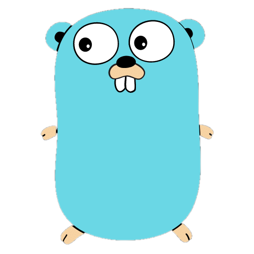

### yet another InfoSec enthusiast, researcher, ctf enjoyer 🪼

  

  
  
  
  
  
  
  
  

---
## lang&services

 
   
   
   
   
   
   
   
   
  
   
   

---

## current projects

still working on it - should be done soon..
